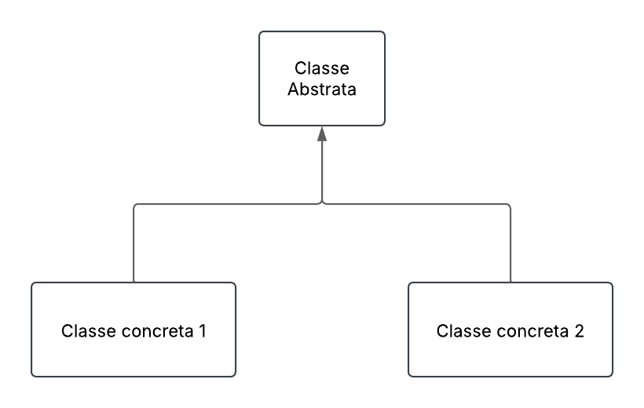
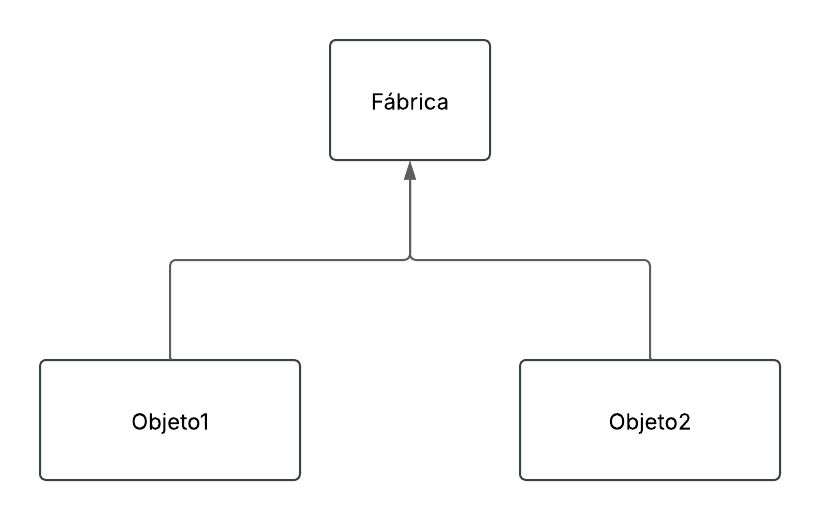

## Resposta - Questão 10

O padrão de projetos Template estrutura permite que subclasses personalizem partes específicas do processo, mantendo a estrutura geral, enquanto o Factory Method fornece uma interface para criar objetos, delegando a responsabilidade de decidir a classe concreta "fábrica". Enquanto o Template Method foca na organização e variação de um algoritmo, o Factory Method se concentra na criação de objetos, possibilitando que subclasses escolham como e quais objetos criar de forma flexível.

[Exemplo Template: sistema da coca-cola, onde o processo geral é o mesmo, mas as etapas podem variar para diferentes tipos de bebidas](https://github.com/pedrjose/prova-monitoria-map/blob/main/cocaCola.py);

[Exemplo Factory: sistema da loja da renner, o processo de compra pode ser o mesmo, mas varia de acordo com o tipo de pagamento ou envio](https://github.com/pedrjose/prova-monitoria-map/blob/main/renner.py).

