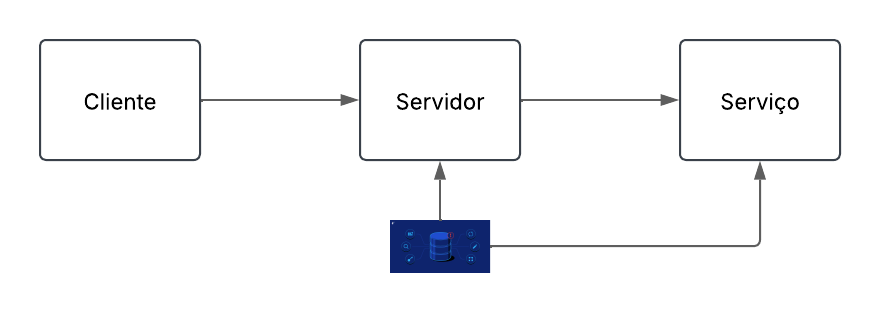
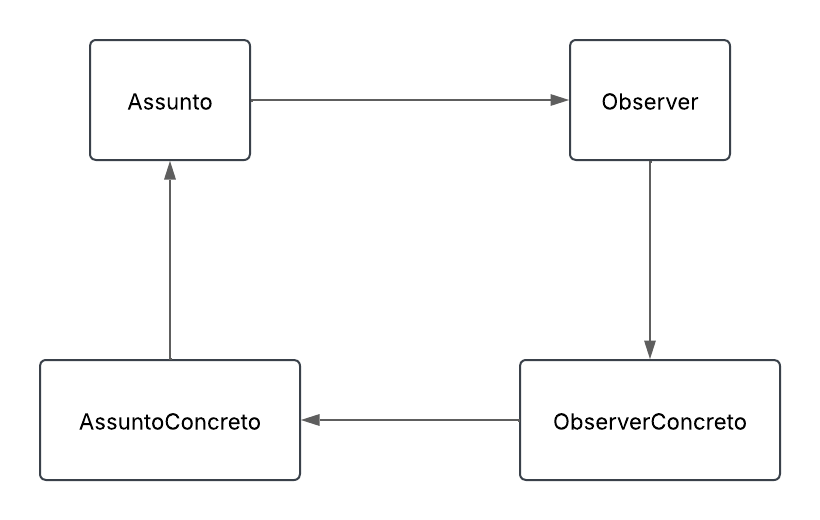

## Resposta - Questão 9

Observer segue um padrão onde o desenvolvedor define mecanismos para notificar os objetos do projeto, fazendo com que eles se comuniquem e alertem alterações uns aos outros. Adapter atua de forma semelhante, porém, além de se observarem, objetos colaboram entre si.

